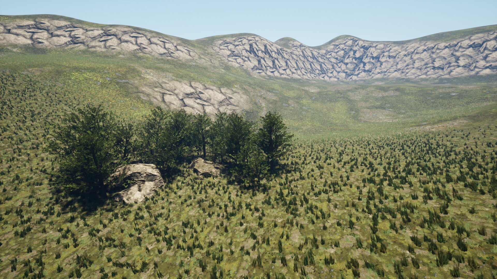
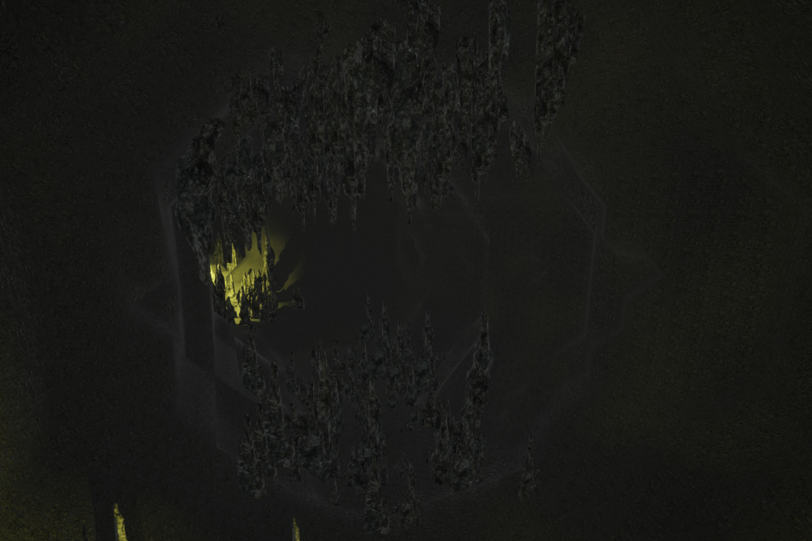
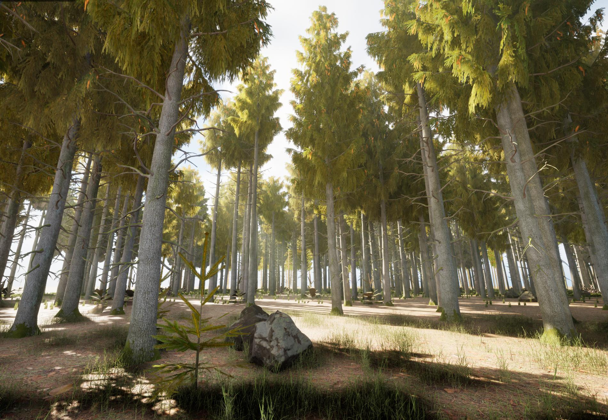
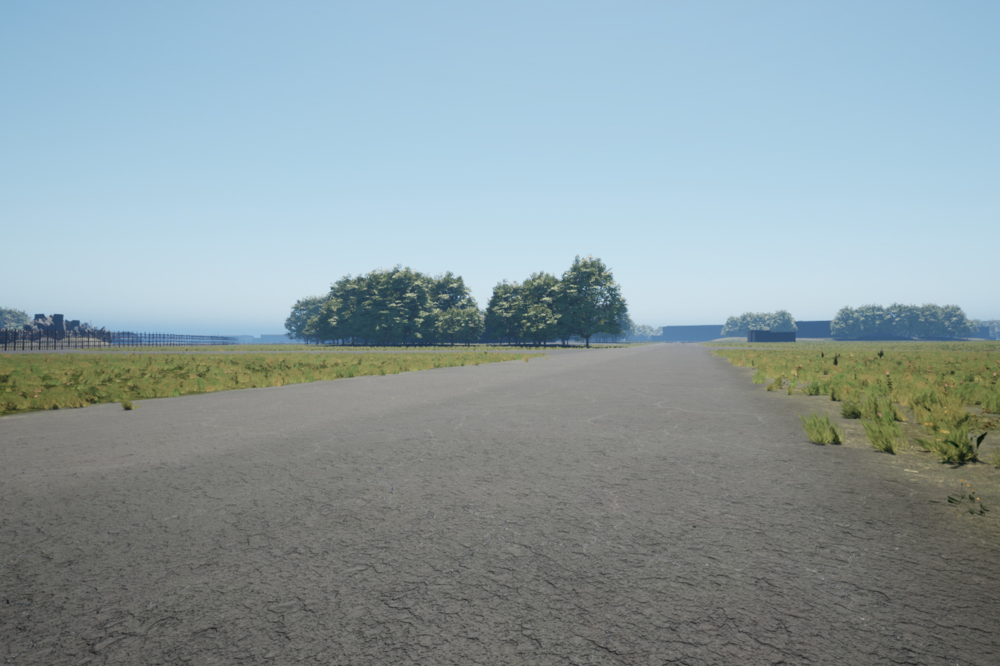
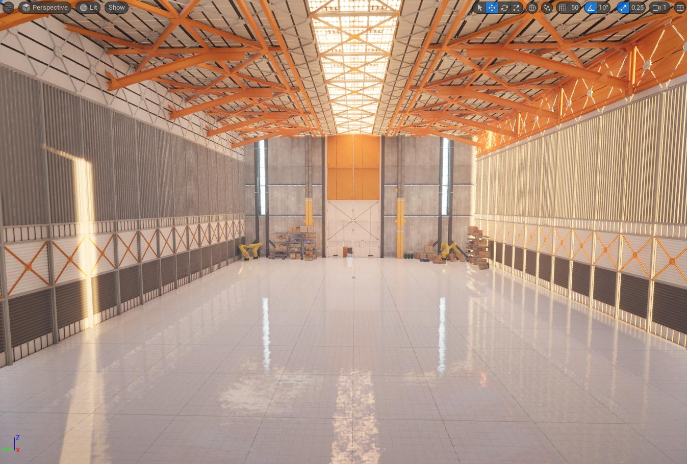
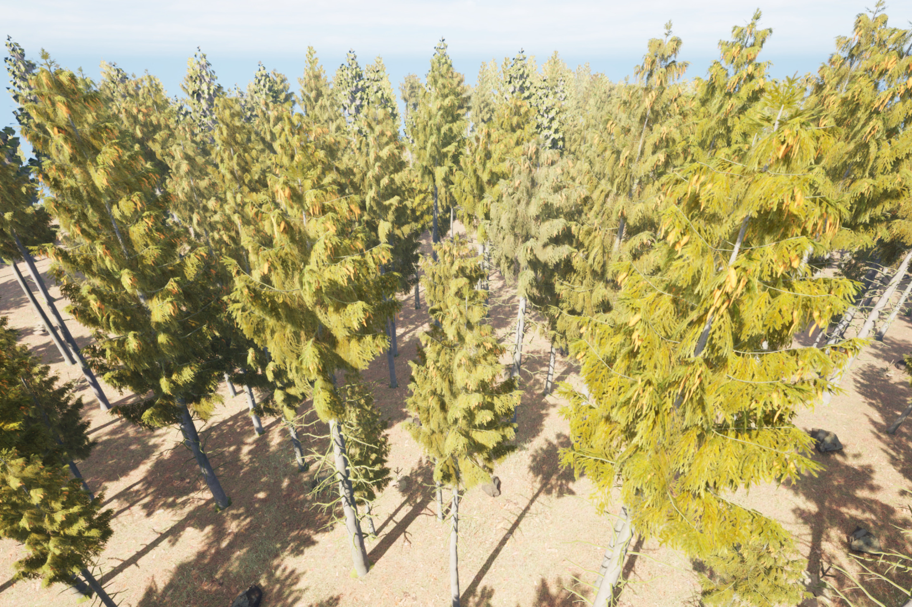

# MRS FlightForge Simulator


## Requirements

* A dedicated NVidia GPU (at least MX450, RTX is recommended) or a comparable AMD GPU
* 3 GB of HDD space

## The Maps

| Map Name  |                         | Map Name       |                               |
|-----------|-------------------------|----------------|-------------------------------|
| Valley    |     | Cave           |             |
| Forest    |     | Erding Airbase |   |
| Warehouse |  | Infinite forest |  |

## Controls

* `m`/`ESC` - show menu for switching graphics and worlds

## Installation

### Linux

1. Install the [MRS UAV System](https://github.com/ctu-mrs/mrs_uav_system)
2. Install the MRS UAV System UE5 endpoint
```bash
sudo apt install ros-noetic-mrs-uav-unreal-simulation
```
3. Download the and unpack [Unreal Engine Drone Simulator](https://nasmrs.felk.cvut.cz/index.php/s/MnGARsSwnpeVy5z)
4. Launch the UE5 Simulator by `./flight_forge.sh`. Alternatively, start it in a headless mode via `./flight_forge.sh -renderOffScreen`.
6. Start the MRS UAV System UE5 endpoint
```bash
roscd mrs_uav_unreal_simulation
./tmux/one_drone/start.sh
```

### Windows

Requirements:
* Windows 11 + updates
* WSL 2.0

1. Install Ubuntu 20.04 into the WSL 2.0 using the Microsoft Store
2. Install the [MRS UAV System](https://github.com/ctu-mrs/mrs_uav_system) into WSL 2.0
3. Create `.wslconfig` file in `C:/Users/<User>/.wslconfig`
4. Place the following content into `.wslconfig`
```
[wsl2]
firewall=false
networkingMode=mirrored
debugConsole=false
[experimental]
hostAddressLoopback=true
```
5. Restart the WSL by issuing `wsl --shutdown` into a comand line.
6. Install the MRS UAV System UE5 endpoint
```bash
sudo apt install ros-noetic-mrs-uav-unreal-simulation
```
7. Download and unpack the [Unreal Engine Drone Simulator](https://nasmrs.felk.cvut.cz/index.php/s/MnGARsSwnpeVy5z)
8. Start the Unreal Engine Drone Simulator
9. Start the MRS UAV System UE5 endpoint
```bash
roscd mrs_uav_unreal_simulation
./tmux/one_drone/start.sh
```
10. The first start might require hitting "CTRL+C" in the `roscore` tab of the tmux session. The roscore is always stuck for the first time after rebooting the computer.

## TODO

* UAVs don't see eachother in their cameras / LiDARS
* possible coloring of the depth pointcloud using the segmented RGB image
* ability to switch worlds in C++ from the ROS side
* ability to switch graphics scaling in C++ from the ROS side
* finer settings of the graphics scaling than (low, middle, etc).
* adding weather effects controllable form the ROS side
